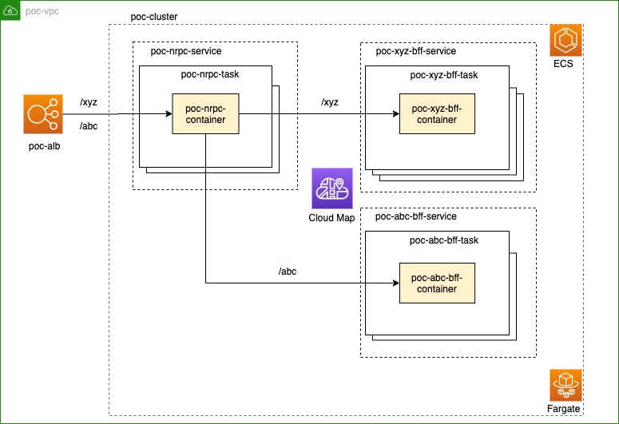

# ECS Fargate NRPC Poc



## Deployment

デプロイする際は `containers/nrpc/nginx.conf` の `upstream` をデプロイ用に事前に差し替える。

```
  upstream backend {
    # docker-compose up時
    # server bff:3000;
    # ECSデプロイ時
    server poc-xyz-bff-service.poc.internal;
  }
```

```sh
npm i
npm run build
cdk bootstrap
npm run deploy:all
```

## Load testing

### Setup

```sh
brew install k6
```

### Running

```sh
npm run test:load
```
